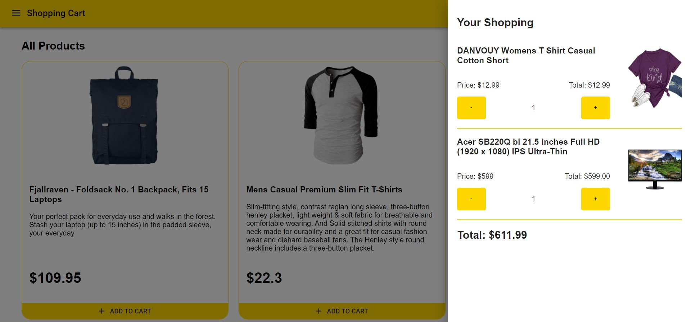

### Dependencies

# Shopping Cart Web Application

Shopping Cart web application is created to practising how to use TypeScript and Material UI. It displayed 20 products which be fetched from Fake Store API. After I had done this work, I found many advantages when using TypeScript. It maybe hard in the first time because you have to write type of almost everything when you want to define something. However, it make sure that the error in your project will decrease dramatically. This also my first time using styled component and it totally amazing with their reusability and convenience.

### Technologies

### Dependency

- typescript - use TypeScript in React
- material-ui/core - Material UI
- material-ui/icons - Material UI icon
- react-query - hooks for fetching data
- styled-components - make JS or TS component has ability to style other components.

### Tools

- [Fake Store API](https://fakestoreapi.com/) - fake store rest API for your e-commerce or shopping website prototype.

### Description

- 20 products are displayed on the website with Fake Store API and react-query
- purchase the product by clicking add to cart button
- whenever you click add to cart, the amount of products will be appeared at the cart icon in the top-right corner.
- click the cart icon to see what products you added
- the aside bar will appear from the right to show everything you added.
- you can add more or remove the product that you added.
- the total is calculated and show in the bottom of the aside bar.
- use material UI and styled-component to design all of the components
- full responsive website
